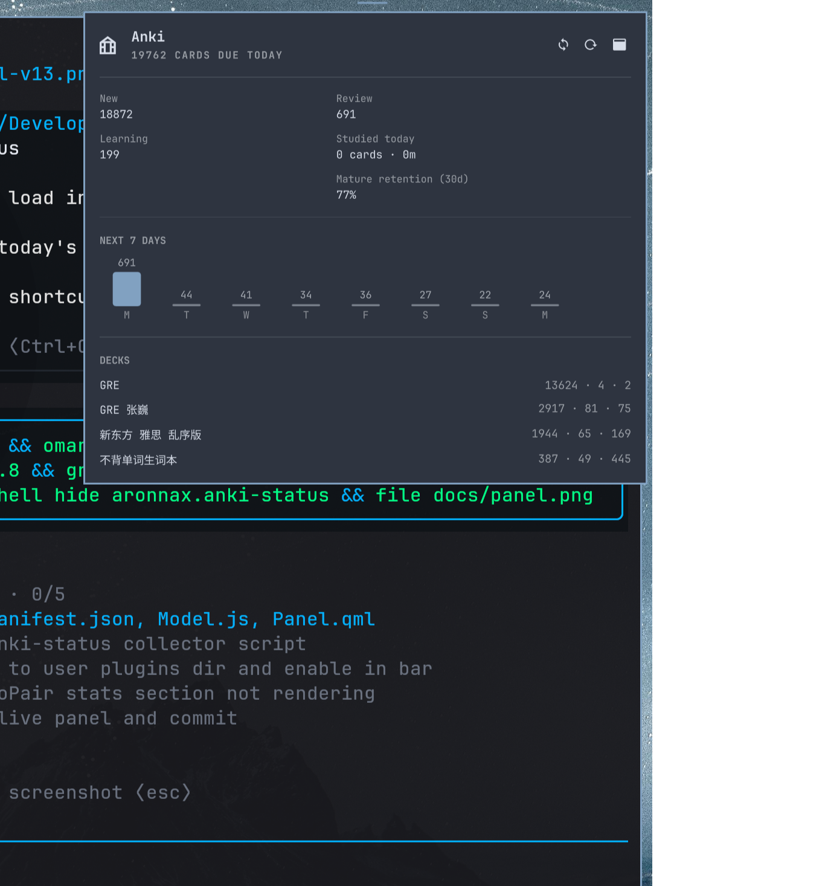

# Anki Status

Anki review load in the Omarchy bar: an icon with a configurable daily metric
and a popup panel with today's queues, the week-ahead forecast, per-deck
breakdown, and sync/review shortcuts.



## Install

```bash
omarchy plugin add https://github.com/aronnaxlin/omarchy-anki-status-plugin.git --enable --yes
```

Or by hand: copy this repo into `~/.config/omarchy/plugins/aronnax.anki-status/`,
then `omarchy-shell shell rescanPlugins` and `omarchy plugin enable aronnax.anki-status`.

## What it shows

- **Bar pill** — The selected daily metric: cards due (default), cards
  studied, study time, or icon only. With no cards due, it shows only the
  icon so the interactive display selector remains available.
- **Hero** — card count status; trailing buttons for sync, refresh,
  and opening Anki.
- **Today's queues** — a scope picker for all decks or one top-level deck;
  new / learning / review, cards studied today with time, and 30-day mature
  retention update for that scope.
- **Forecast** — review cards due across the next N days, today highlighted.
- **Decks** — one row per top-level deck (subdecks roll up), `new · learn · review`.

## Data source

`bin/anki-status` (Python, stdlib only) opens `~/.local/share/Anki2/<profile>/collection.anki2`
with SQLite's immutable mode — no locks, so it never stalls behind Anki's own
writes; the WAL tail (at most the review currently on screen) is skipped.
It reads the day-rollover anchor from the collection's `rollover` /
`creationOffset` config, today's queues from `cards`, today's studied count
and 30-day mature retention from `revlog`, and the new-card daily caps from
the protobuf-encoded `deck_config` rows (a tiny hand-rolled wire parser, no
protobuf dependency).

## Interactions

- Bar pill: left = panel, right = sync, middle = refresh.
- Panel: `r` refresh, `s` sync, `o` open Anki, `d` cycles the statistics
  scope, `a` restores all decks; Tab moves to the neighboring bar panel, Esc
  closes.
- IPC: `omarchy-shell aronnax.anki-status <open|close|toggle|refresh|sync>` —
  or via the shell target: `omarchy-shell shell toggle aronnax.anki-status '{}'`.

## Settings
Settings are available from the **Bar display** selector in the Anki popup and
are saved to the widget's entry in `~/.config/omarchy/shell.json`.

| Key | Default | What it does |
|---|---|---|
| `refreshIntervalSec` | `300` | How often the status snapshot regenerates |
| `forecastDays` | `7` | How many days the forecast chart covers |
| `barMetric` | `Due cards` | Bar content: `Due cards`, `Cards studied`, `Study time`, or `Icon only` |

The selector updates immediately. Command-line configuration remains available:

```bash
omarchy bar set aronnax.anki-status barMetric 'Study time' --json
```

## License

MIT
